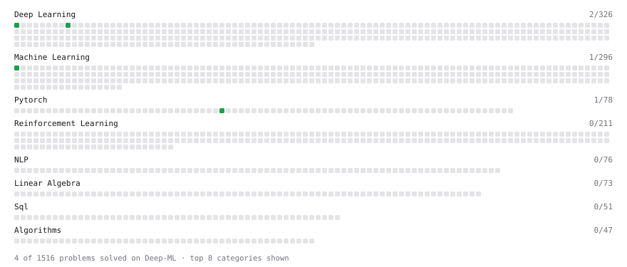

# Deep-ML

My machine learning practice from [Deep-ML](https://www.deep-ml.com). Every solution here was written by hand.

**5** solved · 5 problems · 0 labs · 0 math

[**Browse the interactive portfolio**](https://GregorMilligan.github.io/deep-ml/) to replay this filling in over time.

## Problems

| | Difficulty | Solved | |
| --- | --- | --- | --- |
| [Create and Inspect a Tensor](https://www.deep-ml.com/problems/1220) | easy | 2026-10-07 | [solution](problems/1220-create-and-inspect-a-tensor) |
| [Implement Early Stopping Based on Validation Loss](https://www.deep-ml.com/problems/135) | easy | 2026-10-08 | [solution](problems/0135-implement-early-stopping-based-on-validation-loss) |
| [Implement ReLU Activation Function](https://www.deep-ml.com/problems/42) | easy | 2026-10-07 | [solution](problems/0042-implement-relu-activation-function) |
| [Linear Regression Using Normal Equation](https://www.deep-ml.com/problems/14) | easy | 2026-10-07 | [solution](problems/0014-linear-regression-using-normal-equation) |
| [Sigmoid Activation Function Understanding](https://www.deep-ml.com/problems/22) | easy | 2026-10-07 | [solution](problems/0022-sigmoid-activation-function-understanding) |

---

_This file is regenerated by Deep-ML on every push._
